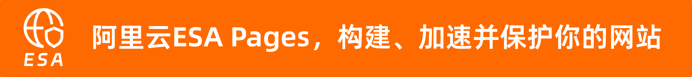

# Edge Privacy Masker

项目简介

Edge Privacy Masker 是一个基于阿里云 ESA Pages 边缘计算的隐私脱敏工具，在边缘侧完成敏感信息识别与处理，避免原始数据上传中心服务器。

为什么必须使用边缘计算

- 敏感数据无需进入中心后端
- 更低延迟
- 更符合隐私合规场景

技术栈

- Vue 3 + Element Plus
- ESA Pages Edge Function
- Serverless / Edge Computing

支持的脱敏类型

- 手机号
- 身份证
- 邮箱
- 银行卡

开发

- 安装依赖：`npm install`
- 启动开发：`npm run dev`
- 构建：`npm run build`

本项目由阿里云ESA提供加速、计算和保护
